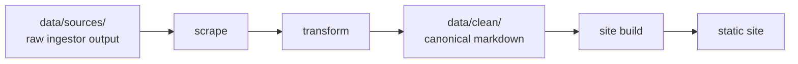
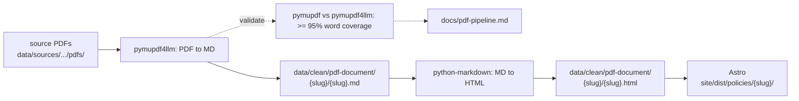

# Opportunity Party

[](LICENSE)
[](https://www.python.org)
[](https://dagster.io)
[](https://astro.build)

A scraping and analysis pipeline for [opportunity.org.nz](https://www.opportunity.org.nz). Web content is scraped, cleaned into canonical markdown, and built into a static site — ready for future analysis or introspection of downstream tooling on the party's people, policies, or manfiest. See [LICENSE](LICENSE) for terms.

## Quickstart

Requires macOS or Linux, [Homebrew](https://brew.sh), and Python 3.12+.

```bash
brew bundle --file=scripts/Brewfile   # direnv, fnm, uv, just, lefthook, …
direnv allow                          # load .envrc (DAGSTER_HOME + venv PATH)
just install                          # uv sync — Python deps
just dev                              # open the Dagster UI
```

This project is shaped for AI-assisted development: every workflow is observable, every command is reproducible, every tool choice is deliberate. The selection of building blocks of which tools + dependencies are used are more significant. Anything that breaks I can verify through [dagster.io](https://dagster.io/), with manual validation of transformations via [obsidian.md](https://obsidian.md/).

## Pipeline



## PDF documents

Policy detail PDFs from opportunity.org.nz (hosted on Google Drive) flow through a parallel pipeline alongside the scraped HTML — downloaded, extracted as structured markdown, validated, and rendered as HTML. The source PDFs are never served; only the extracted content reaches the site.



**Tools:** [`pymupdf4llm`](https://pymupdf.io) extracts tables, headings, and bullet lists with no system dependencies. [`pymupdf`](https://pymupdf.readthedocs.io) provides an independent raw-text signal used only for the validation pass. [`python-markdown`](https://python-markdown.github.io/) renders the cleaned body to HTML with the `extra` extension.

**Where the content lives:** `data/clean/pdf-document/{slug}/{slug}.md` (canonical markdown) and `{slug}.html` (rendered). The Astro build publishes the HTML to `site/dist/policies/{slug}/`. Each item's `meta.json` records `html_path` so consumers can find it without directory scans.

**Checks:** every PDF goes through a two-pass coverage check — pymupdf4llm markdown vs pymupdf raw text — at a 95% word-coverage threshold, plus structural spot-checks (headings, table rows, bullets). Per-PDF results land in `data/clean/_pdf_validation.json`.

**Reference:** [`docs/pdf-pipeline.md`](docs/pdf-pipeline.md) — auto-generated coverage report with per-PDF metrics (word counts, headings, tables, bullets, pass/fail). Regenerate by running the `validation_job` job or launching the `validate_pdf_extraction` asset from `just dev`.

**For the Opportunity Party team:** the canonical markdown at `data/clean/pdf-document/` is the format to host on opportunity.org.nz — it preserves heading hierarchy, lists, and tables without any PDF binary. The rendered HTML at `site/dist/policies/` is equivalent; pick whichever format the existing CMS prefers.

## Key tools

Three things to understand before you touch anything:

**[Dagster](https://dagster.io)** — the Python orchestrator. Every scrape, transform, and build step is an *asset* under `pipeline/defs/assets/`. New sources, transforms, and consumers are added by writing new assets and wiring them into a job. The UI (`just dev`) shows the full lineage of any output back to its raw source — useful for visualisation. AI agents can use the `dg` utility enabled by `direnv`.

**[direnv](https://direnv.net)** — auto-loads `.envrc` when you `cd` into the project. Combined with `uv`, every shell session gets the exact pinned toolchain (and a stable `DAGSTER_HOME`) without global installs. Run `direnv allow` once after cloning.

**[pi.dev](https://pi.dev)** — the AI coding harness this project is shaped for. Skills, agent context, and the Dagster observability surface are designed so an agent can pick up any task without re-explaining the codebase. Additionally I have used `npx skills@latest` for downloading useful skills for project development.

## Working with the data

```
data/
├── sources/    # gitignored, raw ingestor output — write-only
└── clean/      # tracked, canonical markdown + meta.json — read by all consumers
```

Ingestors write to `data/sources/`; everyone else reads from `data/clean/`. Adding a new source or consumer, schema details, and the layer invariants all live in [`docs/data-architecture.md`](docs/data-architecture.md).

## Commands

| Recipe | What it does |
| --- | --- |
| `just install` | `uv sync` — install Python deps |
| `just dev` | Launch the Dagster UI |
| `just check` | `ruff check` + `ruff format --check` + `ty check` (read-only, CI-safe) |
| `just fix` | Auto-fix lint and reformat |
| `just validate` | Verify links in `data/clean/**/*.md` |
| `just hooks-install` | Wire lefthook into `.git/hooks` (once after cloning) |

## Contributing

Only valiadation is running `just check` before opening a PR — it must pass. The same checks run automatically on git pre-commit. To glance over the project structure, start with [`docs/data-architecture.md`](docs/data-architecture.md) for architecture and [`docs/data-schema.md`](docs/data-schema.md) for schema questions.

### Future Roadmap

The Opportunity Party is one voice among many. The most useful analysis often comes from combining this corpus with other sources rather than reading it in isolation. **Candidate sources worth adding if possible**:

- News coverage that mentions the party or its policies
- YouTube/podcast transcripts (`youtube` ingestor is already in place)
- Social feeds (X, Facebook, SubStack) via API clients
- Parliamentary records, select-committee submissions
- External newsletters and policy commentary

A browsable static site that mirrors the party's public-facing pages as plain markdown would be useful for archive and research access — particularly when the live marketing site changes and a snapshot is needed for citation. I'd host this if there's interest. For anything else, feel free to fork or open an issue with the source URL and what you want to extract — the pattern is small and well-defined.