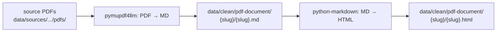
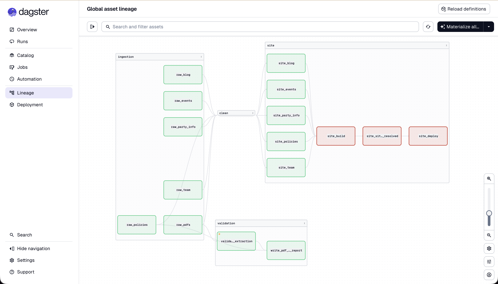
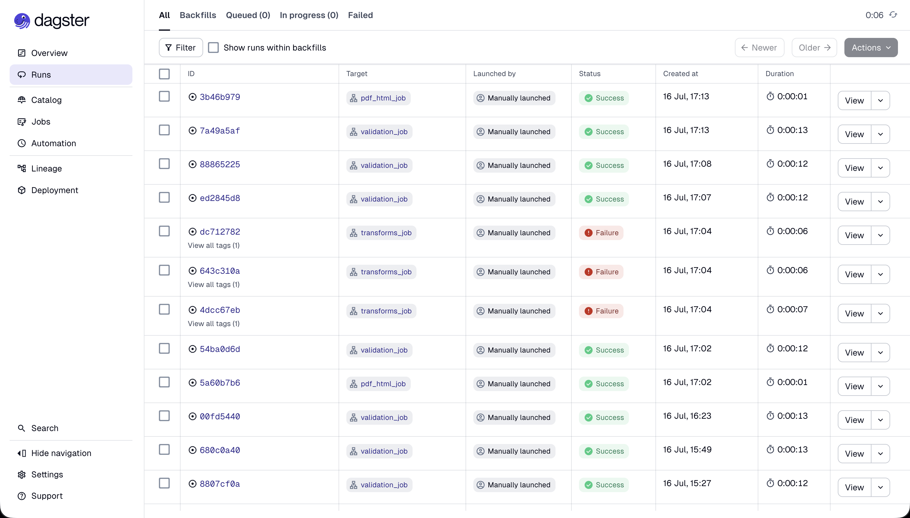
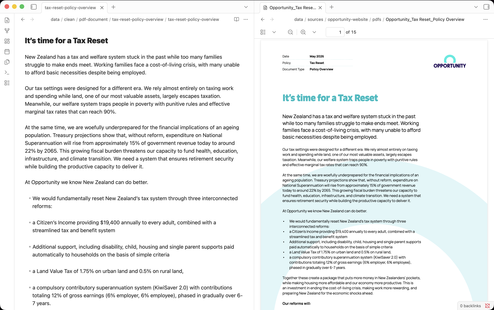

# PDF Extraction Workflow

Onboarding and reviewer guide for the Opportunity Party PDF → MD → HTML pipeline. This document explains how policy PDFs from opportunity.org.nz are processed to be mirrored as
markdown and HTML so AI agents can access them from the campaign site can serve them over HTTPS, and how reviewers can verify the work locally.

## What this workflow is

Opportunity Party's policy detail PDFs are hosted on Google Drive, where AI agents can't fetch the full content. This workflow mirrors each PDF into the repo as markdown and HTML so the policy text is served over HTTPS — readable by AI agents from `data/clean/pdf-document/`, deployable by the campaign site — without exposing the original PDFs. For setup, follow the project README's [Quickstart](../../README.md#quickstart) (Homebrew + direnv + uv).

## Pipeline shape



Three layers, each with a clear owner and contract:

| Layer | Path | Owner | Tracked? |
|---|---|---|---|
| Sources | `data/sources/opportunity-website/pdfs/` | ingestors | no (gitignored) |
| Clean | `data/clean/pdf-document/{slug}/` | transform pipeline | yes |
| Site | `site/dist/policies/{slug}/` | Astro build | built artifact |

The clean layer is the canonical surface: every consumer (campaign site, AI
agent, MCP server, future analysis) reads from there. Manual QA on the clean
layer is what reviewers verify.

## Tools and choices

| Tool                                                    | Role                      | Why this one                                                                      |
| ------------------------------------------------------- | ------------------------- | --------------------------------------------------------------------------------- |
| [`pymupdf4llm`](https://pymupdf.io)                     | PDF → Markdown extraction | Captures tables, headings, and bullet lists with no system dependencies           |
| [`pymupdf`](https://pymupdf.readthedocs.io)             | Raw-text extraction       | Independent ground-truth signal that the production extractor is compared against |
| [`python-markdown`](https://python-markdown.github.io/) | Markdown → HTML rendering | With the `extra` extension (tables, footnotes); same renderer for every MD file   |
| [`gdown`](https://github.com/wkentaro/gdown)            | Google Drive download     | Handles Drive's auth flow and redirects for the raw layer                         |
| [`dagster`](https://dagster.io)                         | Pipeline orchestration    | Asset-based DAG with full observability via UI + `dg` CLI                         |

Each dependency was chosen for a specific reason — see
[`docs/dependencies.md`](../dependencies.md) for the full rationale and
alternatives considered.

## Observability with Dagster

Dagster is the framework this pipeline runs on. It models each pipeline step as
an **asset** — a Python function whose output is a persistent artifact on disk
(a file or directory). Each asset declares which other assets it reads from, and
Dagster builds a directed acyclic graph (DAG) from those declarations. The DAG
*is* the pipeline: every transformation is observable, every output is traceable
to the run that produced it, and the whole graph can be inspected without
reading code. For a general view of our use case, this might look like:



### Asset groups in this project

Assets are split into three layers by their `group_name`:

| Group | Role | PDF-pipeline assets |
|---|---|---|
| `ingestion` | raw scraping | `raw_pdfs` |
| `clean` | normalization | `clean_pdfs`, `pdf_images` |
| `site` | build + deploy | `pdf_html` |

The DAG shape is `ingestion → clean → site`, with PDF assets sitting alongside
the website scrapers. The high-level view shows the layer split at a glance:


### Three UI surfaces to know

**1. Lineage** — the graph view. Nodes are assets, edges are dependencies, group
color is the layer. Expanding a group shows every asset in that layer; fanning
into a single node (e.g. `clean_index`) shows fan-in from multiple sources.
This is where you confirm a new asset is wired in correctly, or see the
pipeline shape at a glance.


**2. Asset detail** — open from any lineage node. Shows the last
materialization timestamp, run ID, item counts, output paths, and a
`View logs` button to jump to the run. This is the per-asset inspection
view — where you verify a specific asset's output.


**3. Runs** — the audit log. Every job launch across the project, sortable by
job, status, and time. Use this to spot patterns (e.g. a job failing
repeatedly) or to find a specific past run.



### Using AI Agents for your work

For AI agents working locally on your project, the `dg` CLI gives the same
observability surface as text. Jobs can be launched, assets enumerated, and
run history queried without a UI. `direnv` loads this project's `.envrc`,
which exports `DAGSTER_HOME` and puts the uv-managed venv on PATH, so `dg`
resolves as a bare command whenever `cd` lands in the repo.

## Reproducing locally

The Dagster UI is the primary path for running jobs. 
### UI

```bash
just dev
```

Runs `uv run dg dev`, which starts the Dagster UI at `localhost:3000`. Pick a
job from the launchpad, click **Launch**, and the run appears in the Runs tab
within seconds. Asset materializations show up in the lineage view as nodes
turn green.

### Verifying it didn't break

```bash
just check
```

Read-only — runs the lint, format-check, type-check, and test suite. Use as a
baseline sanity check; the manual QA checklist is useful to provide on changes.

## Reviewing the output

I recommend manual QA always — for every PDF, open the markdown side-by-side
with the source PDF and confirm the basics: heading hierarchy matches, tables
render correctly, bullet lists are intact, no text is missing or garbled.

[Obsidian.md](https://obsidian.md) is the tool I use for this — a local-first
markdown editor with side-by-side panes and a clean MD renderer. The cleaned
files in `data/clean/pdf-document/{slug}/{slug}.md` open directly without any
plugin setup.



### What to confirm per PDF

- **Heading hierarchy** — matches the PDF structure
- **Tables** — rows + columns intact
- **Bullet lists** — preserved (no merged/collapsed items)
- **No garbled text** — no ligature artefacts or missing words

Manual QA is the actual review gate — `just check` is a baseline sanity
signal, not a substitute. The per-policy QA status lives in the PR-prep checklist of
[`pdf-extraction.md`](../pdf-extraction.md).

## Where to read more

- [`docs/pdf-extraction.md`](../pdf-extraction.md) — full PR-prep checklist and per-policy table
- [`docs/pdf-pipeline.md`](../pdf-pipeline.md) — auto-generated coverage report
- [`docs/data-architecture.md`](../data-architecture.md) — layer invariants (`sources/` → `clean/` → site)
- [`docs/data-schema.md`](../data-schema.md) — meta.json schema for clean items