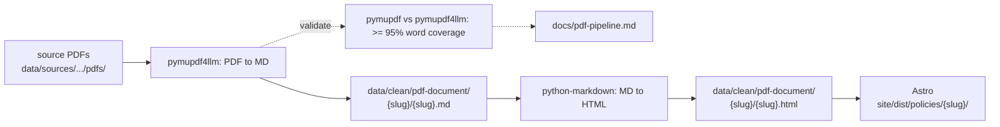

# PDF extraction

Policy detail PDFs from opportunity.org.nz (hosted on Google Drive) flow through a parallel pipeline alongside the scraped HTML — downloaded, extracted as structured markdown, validated, and rendered as HTML. The source PDFs are never served; only the extracted content reaches the site.

## Tools

| Tool | Role |
|---|---|
| [`pymupdf4llm`](https://pymupdf.io) | PDF → Markdown extraction. Captures tables, headings, and bullet lists with no system dependencies. |
| [`pymupdf`](https://pymupdf.readthedocs.io) | Independent raw-text extraction. Used only for the validation pass — provides the ground-truth signal that the production extractor is compared against. |
| [`python-markdown`](https://python-markdown.github.io/) | Markdown → HTML rendering with the `extra` extension (tables, footnotes). |
| [`gdown`](https://github.com/wkentaro/gdown) | Google Drive download for the raw layer (`data/sources/opportunity-website/pdfs/`). |

## Where the content lives

| Path | What |
|---|---|
| `data/sources/opportunity-website/pdfs/*.pdf` | Raw PDFs from Google Drive (gitignored). |
| `data/policies/{slug}/pdf-{type}.md` | Initial extraction output from `pdf_convert.py`. |
| `data/clean/pdf-document/{slug}/{slug}.md` | Canonical markdown — the version consumers read. |
| `data/clean/pdf-document/{slug}/{slug}.html` | Rendered HTML, written by the `pdf_html` Dagster asset. |
| `site/dist/policies/{slug}/` | Astro build output (published HTML). |

Each clean item's `meta.json` records `html_path` (relative to project root) so consumers can find the HTML without scanning directories.

## Checks & validation

Every PDF runs through a two-pass coverage check:

1. **pymupdf4llm** extracts markdown (the production extractor in `pipeline/ingestion/pdf_convert.py`).
2. **pymupdf** independently extracts raw page text (`page.get_text()`).
3. **Word coverage** — fraction of unique words in the pymupdf text that also appear in the pymupdf4llm markdown. Tokens are NFKD-normalised to strip zero-width chars, replacement chars, and combining marks before comparison (handles font-glyph artefacts in the constitution PDF). Threshold: **>= 95%**.
4. **Structural spot-checks** — heading count, table-row count, bullet count on the cleaned body; each must be >= 1 when the source PDF has visible structural elements.

Additionally manual inspection has been applied across all documents (as markdown).

Outputs:

- `data/clean/_pdf_validation.json` — machine-readable per-PDF results (consumed by tests).
- `docs/pdf-pipeline.md` — human-readable coverage report, regenerated by the `validation_job` job (or the `validate_pdf_extraction` asset launched from `just dev`).

## For the Opportunity Party team

The canonical markdown at `data/clean/pdf-document/` is the format to host on opportunity.org.nz — it preserves heading hierarchy, lists, and tables without any PDF binary. The rendered HTML at `site/dist/policies/` is equivalent; pick whichever format the existing CMS prefers.

## Related documents

- [`docs/pdf-pipeline.md`](pdf-pipeline.md) — auto-generated coverage report (per-PDF metrics).
- [`docs/data-architecture.md`](data-architecture.md) — layer invariants (`sources/` → `clean/` → site).
- [`docs/data-schema.md`](data-schema.md) — meta.json schema for clean items.