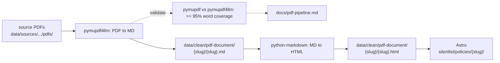

# PDF extraction

Policy detail PDFs from opportunity.org.nz (hosted on Google Drive) flow through a parallel pipeline alongside the scraped HTML — downloaded, extracted as structured markdown, validated, and rendered as HTML. The source PDFs are never served; only the extracted content reaches the site.

## Tools

| Tool | Role |
|---|---|
| [`pymupdf4llm`](https://pymupdf.io) | PDF → Markdown extraction. Captures tables, headings, and bullet lists with no system dependencies. |
| [`pymupdf`](https://pymupdf.readthedocs.io) | Independent raw-text extraction. Used only for the validation pass — provides the ground-truth signal that the production extractor is compared against. |
| [`python-markdown`](https://python-markdown.github.io/) | Markdown → HTML rendering with the `extra` extension (tables, footnotes). |
| [`gdown`](https://github.com/wkentaro/gdown) | Google Drive download for the raw layer (`data/sources/opportunity-website/pdfs/`). |

## Where the content lives

| Path | What |
|---|---|
| `data/sources/opportunity-website/pdfs/*.pdf` | Raw PDFs from Google Drive (gitignored). |
| `data/policies/{slug}/pdf-{type}.md` | Initial extraction output from `pdf_convert.py`. |
| `data/clean/pdf-document/{slug}/{slug}.md` | Canonical markdown — the version consumers read. |
| `data/clean/pdf-document/{slug}/{slug}.html` | Rendered HTML, written by the `pdf_html` Dagster asset. |
| `site/dist/policies/{slug}/` | Astro build output (published HTML). |

Each clean item's `meta.json` records `html_path` (relative to project root) so consumers can find the HTML without scanning directories.

## Checks & validation

Every PDF runs through a two-pass coverage check:

1. **pymupdf4llm** extracts markdown (the production extractor in `pipeline/ingestion/pdf_convert.py`).
2. **pymupdf** independently extracts raw page text (`page.get_text()`).
3. **Word coverage** — fraction of unique words in the pymupdf text that also appear in the pymupdf4llm markdown. Tokens are NFKD-normalised to strip zero-width chars, replacement chars, and combining marks before comparison (handles font-glyph artefacts in the constitution PDF). Threshold: **>= 95%**.
4. **Structural spot-checks** — heading count, table-row count, bullet count on the cleaned body; each must be >= 1 when the source PDF has visible structural elements.

Additionally manual inspection has been applied across all documents (as markdown).

Outputs:

- `data/clean/_pdf_validation.json` — machine-readable per-PDF results (consumed by tests).
- `docs/pdf-pipeline.md` — human-readable coverage report, regenerated by the `validation_job` job (or the `validate_pdf_extraction` asset launched from `just dev`).

## For the Opportunity Party team

The canonical markdown at `data/clean/pdf-document/` is the format to host on opportunity.org.nz — it preserves heading hierarchy, lists, and tables without any PDF binary. The rendered HTML at `site/dist/policies/` is equivalent; pick whichever format the existing CMS prefers.

## PR-prep checklist

After the pipeline runs, every PDF that's been extracted has a corresponding MD and HTML under `data/clean/pdf-document/`. This section is what still needs to be done by hand before these can replace the existing PDF links on opportunity.org.nz.

### Manual visual QA

For each PDF, open the markdown side-by-side with the source PDF and confirm: heading hierarchy matches, tables render correctly, bullet lists are intact, no text is missing or garbled. Reference: [`docs/screenshots/11-manual-qa-policy-documents.png`](screenshots/11-manual-qa-policy-documents.png).

- [ ] Abundant Energy — `abundant-energy-policy-overview`
- [ ] Citizens' Voice — `citizens-voice-policy-overview`
- [ ] Healthy Land — `healthy-land-default`
- [ ] Healthy Oceans — `healthy-oceans-policy-overview`
- [x] Tax Reset (Policy Overview) — `tax-reset-policy-overview`
- [x] Tax Reset (Transition Plan) — `tax-reset-policy-addendum`
- [x] Charter — `charter-default`
- [ ] Constitution — `constitution-default`

Also run `uv run pytest tests/` — covers MD↔PDF coverage thresholds transitively (HTML is a deterministic render of MD, so HTML↔PDF is validated indirectly).

### Per-policy PR table

For each policy, the PR needs to touch: the website page (drop the Google Drive link, point to the new policy HTML on the campaign site) and the repo (the new MD/HTML files). PDF filenames are listed in [`pdf-pipeline.md`](pdf-pipeline.md); the binary PDFs themselves are never committed — they live under `data/sources/` (gitignored) and stay on Google Drive.

| Policy | Website page | Source URL | Markdown | HTML |
|---|---|---|---|---|
| Abundant Energy | opportunity.org.nz/policies/abundant-energy/ | [Drive](https://drive.google.com/file/d/1-QMkAP3CI8_14Sn7FKRafLi283B_O7zI/view) | [md](../data/clean/pdf-document/abundant-energy-policy-overview/abundant-energy-policy-overview.md) | [html](../data/clean/pdf-document/abundant-energy-policy-overview/abundant-energy-policy-overview.html) |
| Citizens' Voice | opportunity.org.nz/policies/citizens-voice/ | [Drive](https://drive.google.com/file/d/116Yio6J2_IVsGUpXzjCQxxaf-fl-8N2L/view) | [md](../data/clean/pdf-document/citizens-voice-policy-overview/citizens-voice-policy-overview.md) | [html](../data/clean/pdf-document/citizens-voice-policy-overview/citizens-voice-policy-overview.html) |
| Healthy Land | opportunity.org.nz/policies/healthy-land/ | [scionresearch.com](https://www.scionresearch.com/__data/assets/pdf_file/0003/80607/MakingZeroTheHero-Summary-Report.pdf) *(not on Drive)* | [md](../data/clean/pdf-document/healthy-land-default/healthy-land-default.md) | [html](../data/clean/pdf-document/healthy-land-default/healthy-land-default.html) |
| Healthy Oceans | opportunity.org.nz/policies/healthy-oceans/ | [Drive](https://drive.google.com/file/d/1V8TIJAxJ2EYV0vYtVewo1co4ndE6eGTq/view) | [md](../data/clean/pdf-document/healthy-oceans-policy-overview/healthy-oceans-policy-overview.md) | [html](../data/clean/pdf-document/healthy-oceans-policy-overview/healthy-oceans-policy-overview.html) |
| Tax Reset (Overview) | opportunity.org.nz/policies/tax-reset/ | [Drive](https://drive.google.com/file/d/1KgTXUgjVipAA7EcDas-EJmOr6ZkeCf9B/view) | [md](../data/clean/pdf-document/tax-reset-policy-overview/tax-reset-policy-overview.md) | [html](../data/clean/pdf-document/tax-reset-policy-overview/tax-reset-policy-overview.html) |
| Tax Reset (Transition Plan) | opportunity.org.nz/policies/tax-reset/ | [Drive](https://drive.google.com/file/d/1c0gMASTHrVvZI87WGFV9NNKyGj1WzpgW/view) | [md](../data/clean/pdf-document/tax-reset-policy-addendum/tax-reset-policy-addendum.md) | [html](../data/clean/pdf-document/tax-reset-policy-addendum/tax-reset-policy-addendum.html) |
| Charter | opportunity.org.nz/party-information/charter/ | [Drive](https://drive.google.com/file/d/1Rpkukrq-GFyMfvRgfJMuNYt4aTdijF2w/preview) | [md](../data/clean/pdf-document/charter-default/charter-default.md) | [html](../data/clean/pdf-document/charter-default/charter-default.html) |
| Constitution | opportunity.org.nz/party-information/constitution/ | [Drive](https://drive.google.com/file/d/1sVxgXWR0zhEofnoGhrbfIwgHiAFeLACx/view) | [md](../data/clean/pdf-document/constitution-default/constitution-default.md) | [html](../data/clean/pdf-document/constitution-default/constitution-default.html) |

### Blockers

- **`productivity-unleashed` (Breakthrough Economy)** — policy page links to a PDF on Google Drive but `pdf_job` has not downloaded it yet. See [`pdf-pipeline.md`](pdf-pipeline.md) → "Missing PDF downloads". Resolve before adding this row to the table above.
- **Healthy Land** — source is on scionresearch.com, not Drive. The "drop the Drive link" step doesn't apply; replace with a link to the campaign site's hosted HTML.

## Related documents

- [`docs/pdf-pipeline.md`](pdf-pipeline.md) — auto-generated coverage report (per-PDF metrics).
- [`docs/data-architecture.md`](data-architecture.md) — layer invariants (`sources/` → `clean/` → site).
- [`docs/data-schema.md`](data-schema.md) — meta.json schema for clean items.