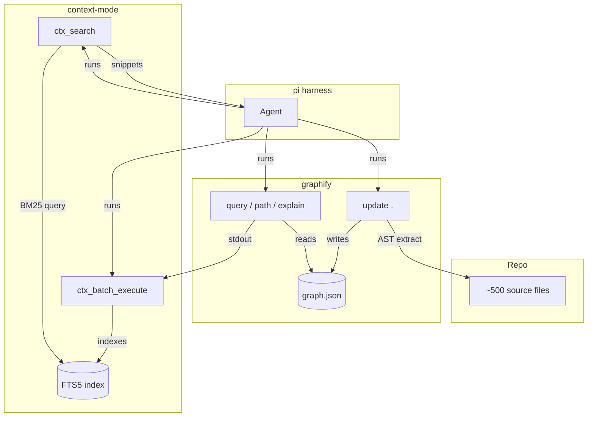
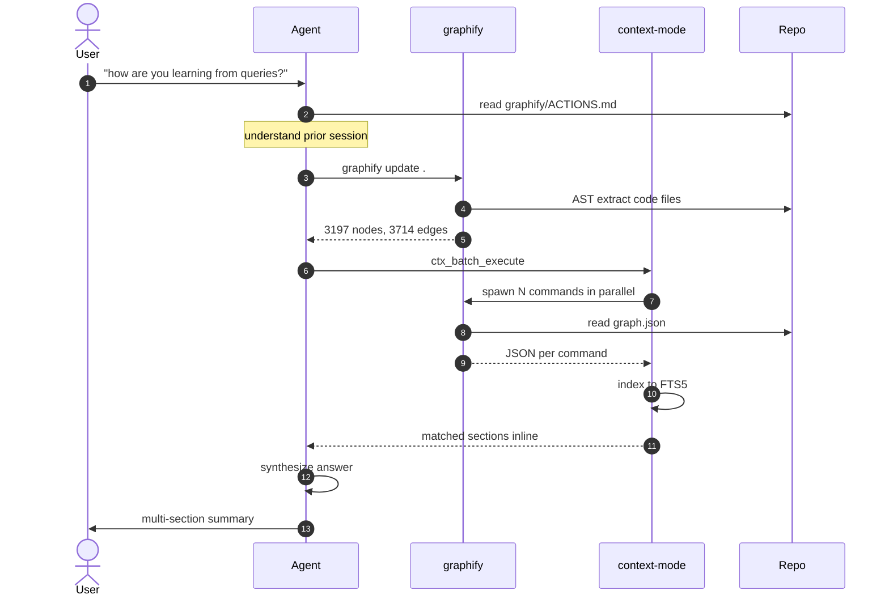
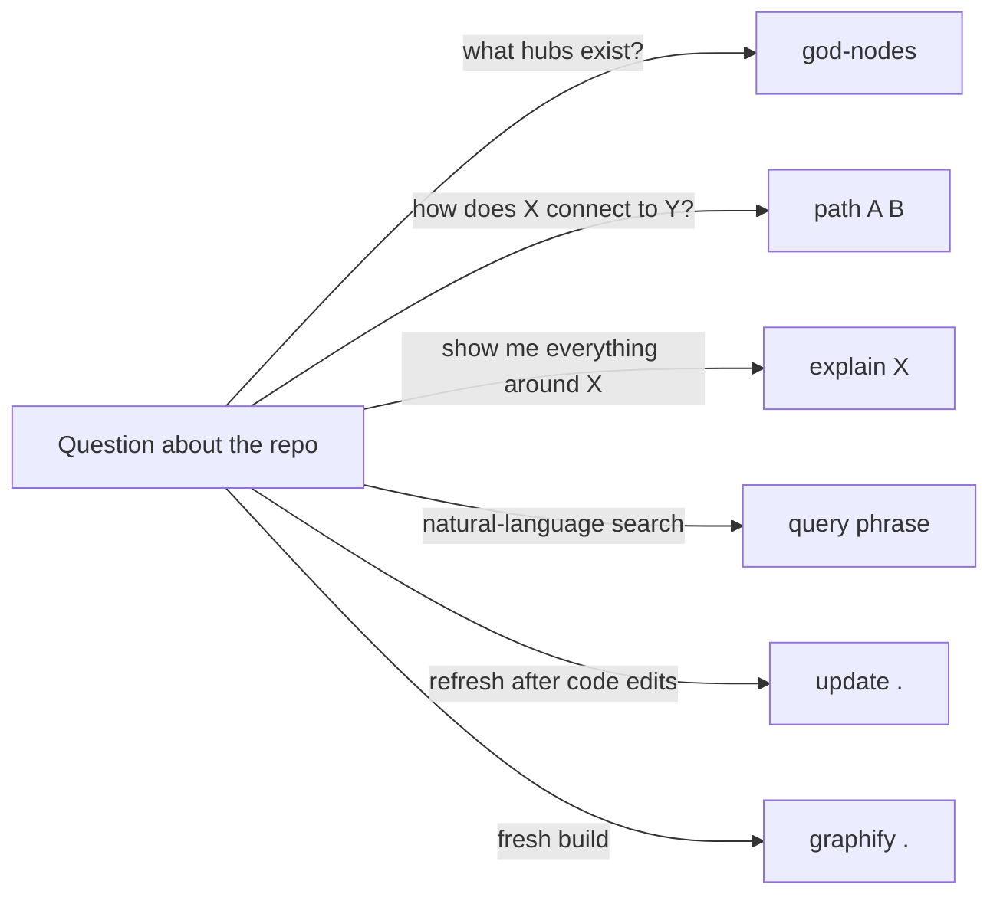
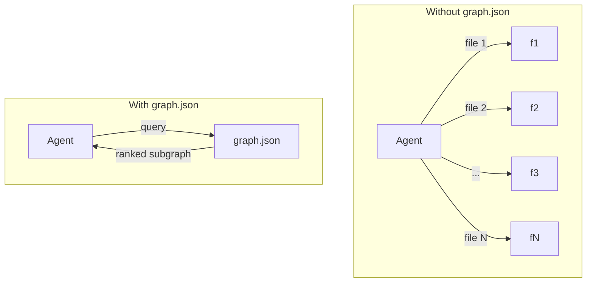

# How I learn from a repo using graphify + context-mode + pi

Companion to `ACTIONS.md`, `CHEATSHEET.md`, `NEXT_STEPS.md`. One diagram per question.

## 1. System map — what each tool owns

The repo, graphify, context-mode, and pi are four boxes with one job each. The agent
threads them together.

**Takeaway:** graphify owns the *index* (`graph.json`), context-mode owns the *cache*
(FTS5 over stdout), the agent owns the *loop* (run → read → synthesize → repeat).
No tool does another's job.

---

## 2. Investigation sequence — what happened in this session

What you saw me do, decomposed.

**Takeaway:** the agent doesn't *read* the graph — it *queries* it, wraps the
queries so context-mode caches them, then retrieves specific sections by
topic. One round trip, not N.

---

## 3. Tool picker — which graphify command for which question

**Takeaway:** `path` and `explain` are *structural* (graph topology);
`query` is *semantic* (BM25 over node text). `god-nodes` is a bird's-eye
view. Pick the verb, then the noun.

---

## 4. Before / after — why `graph.json` is a shortcut

**Takeaway:** `graph.json` is a *precomputed* index over the corpus. The agent
trades N file reads for 1 graph query + 1 retrieval. That's the whole
reason the tool exists — turning *read the world* into *ask the world*.

---

## Reading order

1. Diagram 1 (roles) — orient yourself in the system.
2. Diagram 2 (sequence) — see one full investigation cycle.
3. Diagram 3 (picker) — know which command to use when.
4. Diagram 4 (shortcut) — understand *why* this is fast.